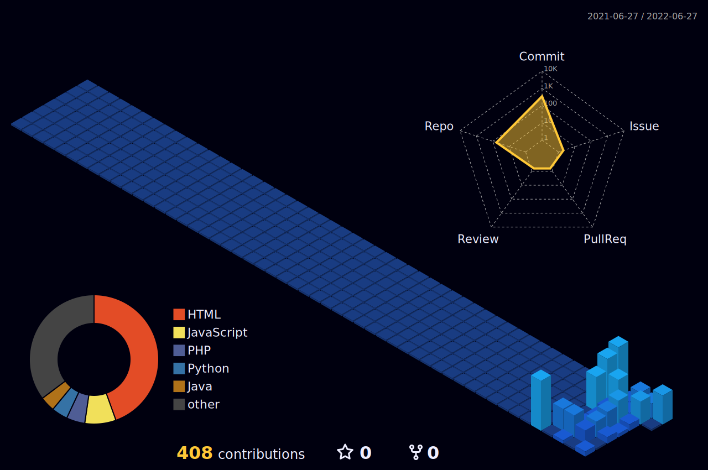

Currently an <b>AI Engineer Apprentice under Super AI Engineer Season 2</b>

- 📫 How to reach me **p.engineering6415@gmail.com**

<h3 align="left">Connect with me:</h3>

<h3 align="left">Languages and Tools:</h3>

                                         

&nbsp;

# WakaTime Stat
<!--START_SECTION:waka-->
<!--END_SECTION:waka-->

# Todoist Stats

<!-- TODO-IST:START -->
🏆  200 Karma Points           
🌸  Completed 3 tasks today           
✅  Completed 3 tasks so far           
⏳  Longest streak is 0 days
<!-- TODO-IST:END -->

<!--
**pangineering/pangineering** is a ✨ _special_ ✨ repository because its `README.md` (this file) appears on your GitHub profile.

Here are some ideas to get you started:

- 🔭 I’m currently working on ...
- 🌱 I’m currently learning ...
- 👯 I’m looking to collaborate on ...
- 🤔 I’m looking for help with ...
- 💬 Ask me about ...
- 📫 How to reach me: ...
- 😄 Pronouns: ...
- ⚡ Fun fact: ...
-->
