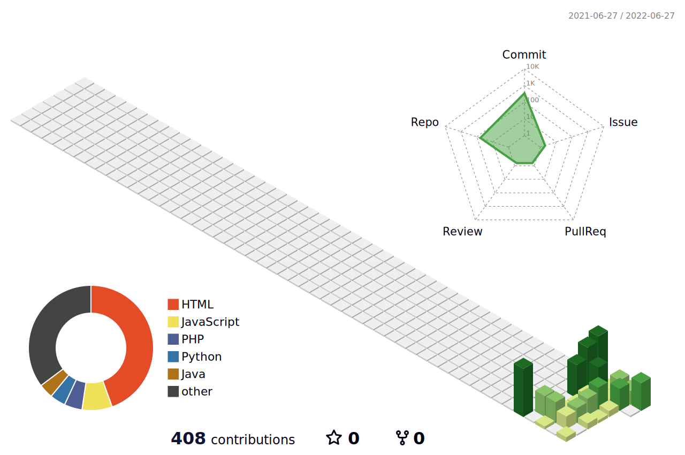

<p></p>

<p>&nbsp;</p>

<p></p>





# Todoist Stats

<!-- TODO-IST:START -->
🏆  845 Karma Points           
🌸  Completed 0 tasks today           
✅  Completed 19 tasks so far           
⏳  Longest streak is 1 days
<!-- TODO-IST:END -->


# WakaTime Stat
<!--START_SECTION:waka-->


**🐱 My GitHub Data** 

> 🏆 229 Contributions in the Year 2022
 > 
> 📦 223.2 kB Used in GitHub's Storage 
 > 
> 🚫 Not Opted to Hire
 > 
> 📜 38 Public Repositories 
 > 
> 🔑 6 Private Repositories  
 > 
**I'm an Early 🐤** 

```text
🌞 Morning    78 commits     ████████░░░░░░░░░░░░░░░░░   31.71% 
🌆 Daytime    80 commits     ████████░░░░░░░░░░░░░░░░░   32.52% 
🌃 Evening    87 commits     ████████░░░░░░░░░░░░░░░░░   35.37% 
🌙 Night      1 commits      ░░░░░░░░░░░░░░░░░░░░░░░░░   0.41%

```
📅 **I'm Most Productive on Sunday** 

```text
Monday       52 commits     █████░░░░░░░░░░░░░░░░░░░░   21.14% 
Tuesday      40 commits     ████░░░░░░░░░░░░░░░░░░░░░   16.26% 
Wednesday    3 commits      ░░░░░░░░░░░░░░░░░░░░░░░░░   1.22% 
Thursday     1 commits      ░░░░░░░░░░░░░░░░░░░░░░░░░   0.41% 
Friday       8 commits      ░░░░░░░░░░░░░░░░░░░░░░░░░   3.25% 
Saturday     54 commits     █████░░░░░░░░░░░░░░░░░░░░   21.95% 
Sunday       88 commits     █████████░░░░░░░░░░░░░░░░   35.77%

```


📊 **This Week I Spent My Time On** 

```text
⌚︎ Time Zone: Asia/Bangkok

💬 Programming Languages: 
Swift                    5 hrs 34 mins       ████████░░░░░░░░░░░░░░░░░   31.85% 
HTML                     4 hrs 21 mins       ██████░░░░░░░░░░░░░░░░░░░   24.95% 
Python                   3 hrs 57 mins       █████░░░░░░░░░░░░░░░░░░░░   22.68% 
CSS                      1 hr 45 mins        ██░░░░░░░░░░░░░░░░░░░░░░░   10.02% 
Markdown                 1 hr 19 mins        ██░░░░░░░░░░░░░░░░░░░░░░░   7.56%

🔥 Editors: 
VS Code                  11 hrs 42 mins      ████████████████░░░░░░░░░   66.95% 
Xcode                    5 hrs 46 mins       ████████░░░░░░░░░░░░░░░░░   33.05%

🐱‍💻 Projects: 
tuna-cat-food            6 hrs 48 mins       █████████░░░░░░░░░░░░░░░░   38.98% 
pangineering.github.io   6 hrs 6 mins        ████████░░░░░░░░░░░░░░░░░   34.98% 
med-slip-ocr             3 hrs 44 mins       █████░░░░░░░░░░░░░░░░░░░░   21.4% 
temporary                17 mins             ░░░░░░░░░░░░░░░░░░░░░░░░░   1.67% 
pangineering             15 mins             ░░░░░░░░░░░░░░░░░░░░░░░░░   1.51%

💻 Operating System: 
Mac                      17 hrs 28 mins      █████████████████████████   100.0%

```

**I Mostly Code in JavaScript** 

```text
JavaScript               7 repos             ████████░░░░░░░░░░░░░░░░░   35.0% 
Python                   5 repos             ██████░░░░░░░░░░░░░░░░░░░   25.0% 
PHP                      2 repos             ██░░░░░░░░░░░░░░░░░░░░░░░   10.0% 
HTML                     2 repos             ██░░░░░░░░░░░░░░░░░░░░░░░   10.0% 
Ruby                     1 repo              █░░░░░░░░░░░░░░░░░░░░░░░░   5.0%

```


**Timeline**

 


 Last Updated on 06/06/2022 00:33:36 UTC
<!--END_SECTION:waka-->

<!--
**pangineering/pangineering** is a ✨ _special_ ✨ repository because its `README.md` (this file) appears on your GitHub profile.

Here are some ideas to get you started:

- 🔭 I’m currently working on ...
- 🌱 I’m currently learning ...
- 👯 I’m looking to collaborate on ...
- 🤔 I’m looking for help with ...
- 💬 Ask me about ...
- 📫 How to reach me: ...
- 😄 Pronouns: ...
- ⚡ Fun fact: ...
-->
